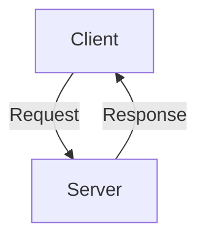
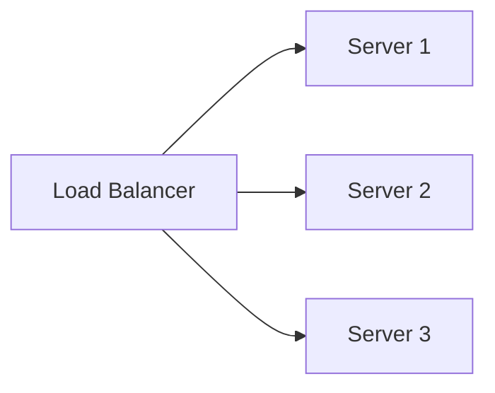
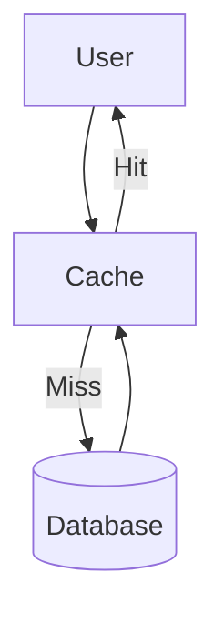
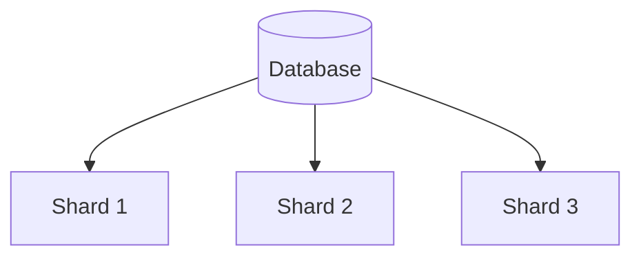
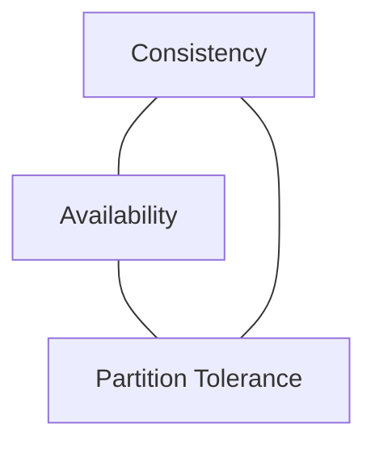
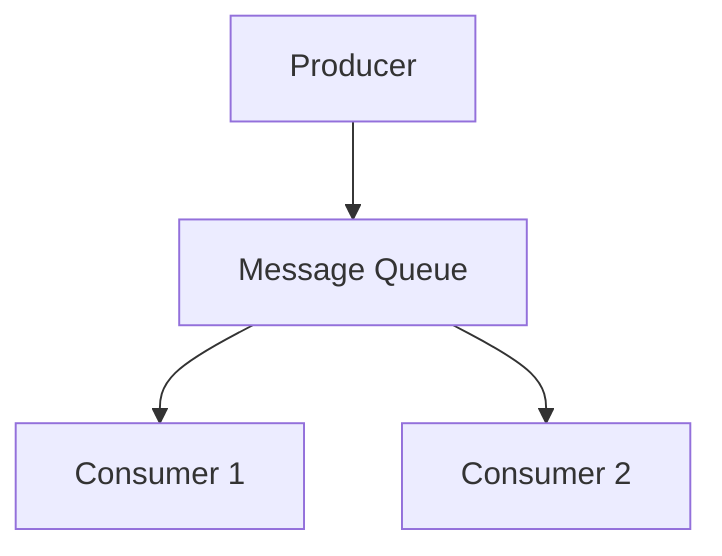
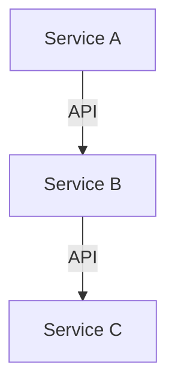

# System Design Basics - Notes

This document summarizes the key concepts from **System Design Basics** in a structured way for quick reference. Suitable for including in your `README.md` with proper formatting and diagrams.

---

## 📖 Table of Contents

1. [Introduction to System Design](#1-introduction-to-system-design)
2. [Key Components of System Design](#2-key-components-of-system-design)
3. [Scalability](#3-scalability)
4. [Caching](#4-caching)
5. [Database Design](#5-database-design)
6. [CAP Theorem](#6-consistency-availability-partition-tolerance-cap-theorem)
7. [Message Queues](#7-message-queues)
8. [Microservices vs Monolith](#8-microservices-vs-monolith)
9. [Monitoring & Logging](#9-monitoring--logging)
10. [Security Considerations](#10-security-considerations)
11. [Real-World Design Problems](#11-real-world-design-problems-practice)
12. [Final Tips](#12-final-tips)

---

## 1. Introduction to System Design

* **System Design** is the process of defining the architecture, components, and data flow of a system to meet requirements.
* Goal: Build **scalable, reliable, and maintainable systems**.
* Involves trade-offs between **performance, cost, and complexity**.

---

## 2. Key Components of System Design

### a. Client-Server Model

* **Client**: Requests services.
* **Server**: Provides services.

### b. Latency vs. Throughput

* **Latency**: Time taken to process a single request.
* **Throughput**: Number of requests handled per second.

### c. Availability & Reliability

* **Availability**: System uptime percentage (e.g., 99.9%).
* **Reliability**: Accuracy of system output.
* Ensured via **replication, redundancy, and failover mechanisms**.

---

## 3. Scalability

### a. Vertical Scaling

* Add more resources (CPU, RAM) to a single machine.
* Easier but limited.

### b. Horizontal Scaling

* Add more machines and distribute traffic.

### c. Load Balancing

* Algorithms: **Round Robin, Least Connections, IP Hash**.
* Improves **scalability & fault tolerance**.

---

## 4. Caching

* **Purpose**: Reduce latency and DB load.
* **Types**:

  * Client-side (browser)
  * CDN
  * Server-side (Redis, Memcached)
* **Eviction Policies**: LRU, LFU, FIFO.

---

## 5. Database Design

### a. SQL vs NoSQL

* **SQL**: Structured schema (MySQL, PostgreSQL).
* **NoSQL**: Flexible schema (MongoDB, Cassandra).

### b. Sharding

* Splits data across multiple databases.

### c. Replication

* **Leader-Follower** model.
* Ensures **high availability and redundancy**.

---

## 6. Consistency, Availability, Partition Tolerance (CAP Theorem)

* **CAP Theorem**: Only **two** of the three can be fully achieved.
* **Examples**:

  * CP Systems: RDBMS (Consistency + Partition tolerance).
  * AP Systems: DynamoDB (Availability + Partition tolerance).

---

## 7. Message Queues

* Enable **asynchronous communication**.
* Examples: Kafka, RabbitMQ, SQS.
* Benefits: Decoupling, scalability, fault tolerance.

---

## 8. Microservices vs Monolith

### Monolith

* Single codebase, tightly coupled.

### Microservices

* Independent services communicating via APIs.
* **Pros**: Scalability, independent deployment.
* **Cons**: Complexity, service discovery.

---

## 9. Monitoring & Logging

* **Monitoring**: Prometheus, Grafana.
* **Logging**: ELK stack (Elasticsearch, Logstash, Kibana).
* Track **latency, CPU, memory, traffic**.

---

## 10. Security Considerations

* **Authentication**: OAuth, JWT.
* **Encryption**: TLS/SSL.
* **Rate Limiting & Throttling**: Prevent abuse.

---

## 11. Real-World Design Problems (Practice)

* Design **URL Shortener** (bit.ly).
* Design **Instagram Feed**.
* Design **Food Ordering System**.
* Design **WhatsApp/Chat System**.

---

## 12. Final Tips

✅ Always clarify requirements before designing.
✅ Identify bottlenecks early.
✅ Think in terms of **trade-offs**.
✅ Use **diagrams** (architecture, data flow).
✅ Justify your **design decisions**.

---

✨ This note provides a **detailed, well-formatted reference** for **System Design Basics** that you can directly add to your GitHub `README.md`.

